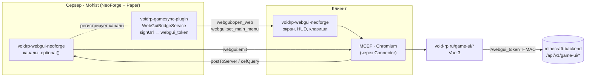
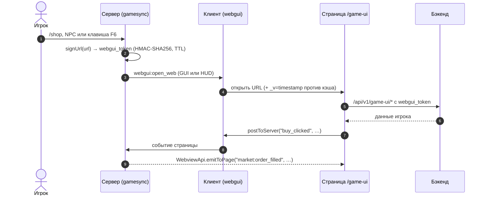

# 🖥️ VoidRP WebGUI NeoForge

> NeoForge-мод (клиент + сервер): встроенный Chromium (MCEF) в клиенте Minecraft — страницы сайта и HUD поверх игры,
> события между сервером и страницей, горячие клавиши.


[](https://github.com/VOIDRP-MINECRAFT/voidrp-webgui-neoforge/actions/workflows/build.yml)


---

## 🗺️ Место в экосистеме





**Ключевые детали архитектуры:**
- Серверный мод регистрирует каналы с `.optional()` — handshake всегда проходит без ошибок
- Bukkit не может диспатчить NeoForge-команды, поэтому **весь транспорт — через `WebGuiBridgeService.sendPluginMessage()`** в Paper-плагине
- `displayTest="IGNORE_ALL_VERSION"` в `neoforge.mods.toml` — исключает дисконнект при несовпадении версий мода

---

## ✨ Возможности

### Управление браузером клиента
- **Открытие GUI** — fullscreen интерфейс поверх игры
- **HUD overlay** — прозрачное наложение поверх gameplay
- **Главное меню (F6)** — задаёт URL для клавиши меню

### Двунаправленные события (v1.2.0+)

**Сервер → страница** (через Paper-плагин):
```java
WebviewApi.emitToPage(player, "market:order_filled", "{\"item\":\"iron\",\"amount\":64}");
```
```js
window.addEventListener("webgui:market:order_filled", e => showNotification(e.detail));
```

**Страница → сервер** (обрабатывается в `WebviewServerEvents`):
```js
window.webgui.postToServer("buy_clicked", JSON.stringify({ itemId: "iron_sword" }));
```

### Entity binding (v1.3.0)
- Правый клик по сущности → открывает привязанный URL с плейсхолдерами `{entityId}`, `{entityType}`, `{playerName}`, `{playerUuid}`
- Команды: `/webgui bind entity <selector> <url>` и `/webgui unbind entity <selector>`
- JS: `window.webgui.entity` — контекст открывшей сущности

### VoidRP кастомные JS-каналы (page→game)
Страница может управлять игрой через `window.cefQuery`:
```js
// Выполнить команду от имени игрока
postToGame({ channel: "run_command", command: "/pm pickup" })

// Открыть другой GUI без запроса к серверу
postToGame({ channel: "open_gui", url: "https://void-rp.ru/game-ui#market" })

// Открыть HUD
postToGame({ channel: "open_hud", url: "https://void-rp.ru/game-ui/hud" })
```

### Горячие клавиши (переназначаются в «Управлении»)

| Клавиша | Действие |
|---|---|
| <kbd>F6</kbd> | Главное меню (URL задаёт сервер через `webgui:set_main_menu`) |
| <kbd>`</kbd> | Взаимодействие с HUD (мышь в оверлей) |
| <kbd>→</kbd> | Спрятать/показать HUD (анимация сдвига) |
| <kbd>↑</kbd> | Открыть самое свежее уведомление HUD |
| не назначена | Перезагрузить страницу WebGUI |

Каждое открытие страницы получает параметр `_v=<время>`, поэтому после деплоя фронтенда игроки сразу видят
новую версию, а хешированные JS/CSS по-прежнему берутся из кэша.

---

## 📋 Требования

| Компонент | Версия |
|---|---|
| Minecraft | 1.21.1 |
| NeoForge | 21.1.232 |
| Java | 21 |
| Mohist / Connector | для Fabric MCEF |

Версионно-зависимый код лежит в `src/versions/v1211` и `src/versions/v262`; сборка под 26.2 — `./gradlew jar -PmcVer=26.2`.

Клиентам необходим тот же `webgui-1.3.0+mc1.21.1.jar` + `mcef-keksuccino-2.2.0-1.21.1-fabric.jar` в лаунчер-паке.

---

## 🚀 Сборка и деплой

```bash
cd voidrp_webgui_neoforge
./gradlew jar
# → build/libs/webgui-1.3.0+mc1.21.1.jar  (75 КБ)

# Деплой на сервер
cp build/libs/webgui-1.3.0+mc1.21.1.jar \
   /path/to/minecraft_server/mods/webgui-1.3.0+mc1.21.1.jar

# Деплой в лаунчер-пак (клиентская часть)
cp build/libs/webgui-1.3.0+mc1.21.1.jar \
   /home/mironoouv/launcher/pack/mods/webgui-1.3.0+mc1.21.1.jar

# Обновить манифест лаунчера
python3 scripts/generate_launcher_manifest.py
```

**После деплоя обязателен рестарт сервера** — NeoForge загружает `neoforge.mods.toml` только при старте.

---

## 🏗️ Структура проекта

```
voidrp_webgui_neoforge/
├── build.gradle                   NeoGradle, compileOnly MCEF jar
├── gradle.properties              neo_version=21.1.232, mod_version=1.3.0
├── libs/mcef-keksuccino.jar       MCEF только для компиляции
└── src/main/java/land/webgui/
    ├── WebGUIMod.java             @Mod, регистрация каналов + серверных событий
    ├── WebviewNetworking.java     ВСЕ каналы через .optional()
    ├── WebviewPayloads.java       CustomPacketPayload + StreamCodec (NeoForge API)
    ├── WebGUIClientSetup.java     @EventBusSubscriber CLIENT: FMLClientSetupEvent
    ├── WebGUIClientForgeEvents.java  ClientTickEvent, RenderGuiEvent, InputEvent
    ├── WebGUIForgeEvents.java     ServerStartingEvent, PlayerLoggedInEvent
    ├── WebHudOverlay.java         HUD через raw GL texture ID (не ResourceLocation)
    ├── WebViewScreen.java         extends Screen (Mojang mappings)
    ├── WebSession.java            единый экземпляр браузера
    ├── WebviewClientBridge.java   push client info → window.webgui.client
    ├── server/
    │   ├── WebviewServerEvents.java  CopyOnWriteArrayList вместо Fabric Event<T>
    │   ├── WebviewServerConfig.java  FMLPaths.CONFIGDIR (не FabricLoader)
    │   └── WebviewEntityContext.java BuiltInRegistries (не Fabric Registries)
    ├── EntityBindingStore.java    FMLPaths.CONFIGDIR → entity_bindings.json
    └── mixin/
        ├── CefUtilMixin.java      GPU флаги для CEF (remap=false)
        └── MouseHandlerMixin.java @Mixin(MouseHandler.class) — Mojang-имя для Mouse
```

---

## 🔧 Ключевые технические детали

### Каналы с `.optional()`

```java
private static void onRegisterPayloads(RegisterPayloadHandlersEvent event) {
    PayloadRegistrar registrar = event.registrar("1").optional();  // ← все каналы опциональны
    registrar.playToClient(OpenWebS2CPayload.TYPE, ...);       // webgui:open_web
    registrar.playToClient(WebUIMainMenuPayload.TYPE, ...);    // webgui:set_main_menu
    registrar.playToClient(WebviewEmitS2CPayload.TYPE, ...);   // webgui:emit
    registrar.playToServer(WebviewPageEventC2SPayload.TYPE, ...); // page→server events
}
```

`.optional()` — NeoForge не требует эти каналы ни от сервера, ни от клиента при handshake.

### Рендер браузера через raw GL texture ID

MCEF Fabric jar использует `class_2960` (intermediary ResourceLocation) — недоступно в NeoForge classpath. Рендер через raw GL:

```java
int texId = browser.getRenderer().getTextureID();
RenderSystem.setShader(GameRenderer::getPositionTexShader);
RenderSystem.setShaderTexture(0, texId);
var buf = Tesselator.getInstance().begin(VertexFormat.Mode.QUADS, DefaultVertexFormat.POSITION_TEX);
// ... addVertex с UV-координатами
BufferUploader.drawWithShader(buf.buildOrThrow());
```

### Fabric → NeoForge: таблица маппингов

| Что | Fabric | NeoForge (этот мод) |
|-----|--------|---------------------|
| Mod entry | `ModInitializer.onInitialize()` | `@Mod` конструктор с `IEventBus modBus` |
| Client init | `ClientModInitializer.onInitializeClient()` | `FMLClientSetupEvent` на MOD bus |
| Events (server) | `ServerLifecycleEvents` | `ServerStartingEvent` (FORGE bus) |
| Events (client) | `ClientTickEvents` | `ClientTickEvent.Post` (FORGE bus) |
| Key bindings | `KeyBindingHelper.registerKeyBinding()` | `RegisterKeyMappingsEvent` (MOD bus) |
| Network channels | `PayloadTypeRegistry.playS2C()` | `RegisterPayloadHandlersEvent` + `.optional()` |
| S2C send | `ServerPlayNetworking.send()` | `PacketDistributor.sendToPlayer(player, payload)` |
| Config dir | `FabricLoader.getInstance().getConfigDir()` | `FMLPaths.CONFIGDIR.get()` |
| Entity registry | `Registries.ENTITY_TYPE.getId(type)` | `BuiltInRegistries.ENTITY_TYPE.getKey(type)` |
| Mixin mouse | `@Mixin(Mouse.class)` | `@Mixin(MouseHandler.class)` |

---

## ⚙️ Конфигурация

**`config/webgui/server.json`** — создаётся автоматически при первом запуске:
```json
{
  "enableTokens": true,
  "tokenTtlSeconds": 7200,
  "autoHudOnJoin": false,
  "hudUrl": "https://void-rp.ru/game-ui/hud",
  "menuUrl": "https://void-rp.ru/game-ui/menu",
  "tokenSecretBase64": "<auto-generated>"
}
```

**`config/webgui/entity_bindings.json`** — привязки сущностей (управляется командами `/webgui bind/unbind`).

Горячая перезагрузка: `/webgui reload` (OP 2).

---

## 🔗 Связанные репозитории

| Репо | Связь |
|---|---|
| ~~[voidrp-webgui](https://github.com/VOIDRP-MINECRAFT/voidrp-webgui)~~ | _(архивирован 2026-06-23 — заменён этим модом)_ |
| [voidrp-gamesync-plugin](https://github.com/VOIDRP-MINECRAFT/voidrp-gamesync-plugin) | `WebGuiBridgeService` — транспорт пакетов через Bukkit |
| [voidrp-site](https://github.com/VOIDRP-MINECRAFT/voidrp-site) | Сайт с `/game-ui/*` страницами |
| [minecraft-backend](https://github.com/VOIDRP-MINECRAFT/minecraft-backend) | API с `webgui_token` авторизацией |

---

<div align="center">
<a href="https://void-rp.ru">🌐 Сайт</a> ·
<a href="https://github.com/VOIDRP-MINECRAFT">🏠 Организация</a> ·
<a href="WEBGUI_INTEGRATION_PLAN.md">📋 Integration Plan</a>
</div>
